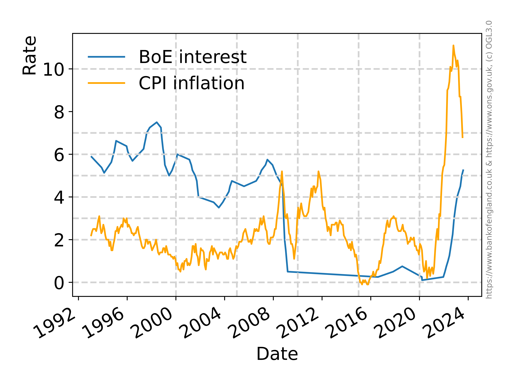

# Mortgage rate calculator and data analysis

* Calculates mortgage payments
* Analyses data on interest rates and inflation

## Install 

```
git clone https://github.com/lmijovic/mortgage.git
cd mortgage
conda create --name mortgage --file requirements.txt 
conda activate mortgage
pip install -e .

```

## Run 

### Mortgage summary:

```
cd scripts

python get_mtg_into.py --amount=300000.0 --rate=0.05 --years=30

```

Produces this summary: 


```
                     Rate:      0.050000
             Month Growth:      1.004167
                      APY:      0.051162
             Payoff Years:            30
            Payoff Months:           360
                   Amount:     300000.00
          Monthly Payment:       1610.47
           Annual Payment:      19325.64
             Total Payout:     579769.20

```

### Data analysis 

UK BoE interest rates \& inflation:

```
cd scripts
ln -s ../data/interest_rates/UK_BOE_interest_rate_Aug23.csv in1.csv
ln -s ../data/inflation/cpi_aug23.csv in2.csv
python plot_rate_profile.py --infile="in1.csv" --label="BoE interest" --infile2="in2.csv" --label2="CPI inflation" --start=01-01-1993 --end=01-09-2023

```

Produces this figure:




### Data preprocessing

Date,Value data is preprocessed into format "%d-%m-%y" 

```
cd scripts

preprocess.py 

```

takes in.csv and writes out.csv 

## TODO

* unit tests

* more flexible plotting options, though json configs 


## Resources
* Office of national statistics  https://www.ons.gov.uk/ . They publish data under Open Government Licence 3.0 https://www.nationalarchives.gov.uk/doc/open-government-licence/version/3/ . Some specific links: https://www.ons.gov.uk/economy/inflationandpriceindices/bulletins/consumerpriceinflation/july2023 ,  https://www.ons.gov.uk/search?q=mortgage .
* Bank of England https://www.bankofengland.co.uk/boeapps/database  https://www.bankofengland.co.uk/statistics/visual-summaries/quoted-household-interest-rates. See BoE monthly minutes for rate predictions. 
* US interest and mortgage rates: https://fred.stlouisfed.org 

